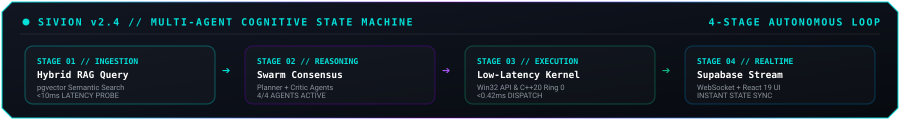

<!-- CUSTOM ANIMATED HEADER (Matching Website) -->

  

<!-- DYNAMIC TYPING SVG BANNER (Native 60 FPS 3D HUD) -->

  

<!-- PROFILE BADGES -->

  

<!-- GITHUB ACHIEVEMENTS & SPECIALIZATIONS -->

  

<!-- HOLOGRAPHIC SYSTEM TELEMETRY CHIP -->

  

<!-- DUAL TIMEZONE GLOBAL AVAILABILITY -->

 

 

### 👨‍💻 Lead Systems Architect & AI Engineer

  

 

<!-- MULTI-AGENT COGNITIVE STATE MACHINE -->

  

 

<table width="100%" style="border-collapse: collapse; border: 1px solid #30363d; border-radius: 8px;">
<tr>
<td width="50%" valign="top" style="padding: 16px; border-right: 1px solid #30363d;">

#### ⚡ Architectural Thesis & Research
- 🤖 **Multi-Agent Orchestration:** Designing distributed intelligent agents with robust tool execution pipelines and low-latency decision loops.
- 🎮 **WebGL 2.0 & Spatial 3D:** Building procedural graphics engines, custom GLSL compute shaders, and high-fidelity interactive digital experiences.
- ⚡ **High-Performance Systems:** Kernel-level Windows tuning, input latency elimination, and concurrent systems programming in Rust, Go, and C++.

</td>
<td width="50%" valign="top" style="padding: 16px;">

#### 🤝 Collaboration & Engagement
- 💼 **Dedicated Engineering Partner:** Full-cycle system design, technical leadership, and production-scale refactoring.
- 🚀 **Flagship Ecosystem:** Architecting [MA Optimizer](https://github.com/Mathiyass/MA-Optimizer), [SIVION Engine](https://mathiya.cc/projects/sivion) & [mathiya.cc](https://mathiya.cc).
- 💬 **Direct Consultation:** Distributed Cloud, Agentic Workflows, Three.js, Next.js, and Supabase.

</td>
</tr>
</table>

 

 

### 📐 Kinetic Architecture Blueprint

  

  

<!-- ISOMETRIC 3D ARCHITECTURE HEX DECK -->

  

 

 

### 🎯 Architectural Capability Radar

  

 

 

### 🛠️ Technology & Architectural Stack Matrix

  

 

 

### 🌟 Flagship Projects & Engineering Case Studies

<table width="100%" style="border-collapse: collapse; border: 1px solid #30363d; border-radius: 8px;">
<thead>
<tr style="background-color: #161b22;">
<th align="left" style="padding: 12px; border-bottom: 1px solid #30363d;">🚀 Project</th>
<th align="left" style="padding: 12px; border-bottom: 1px solid #30363d;">💡 Engineering Highlights</th>
<th align="left" style="padding: 12px; border-bottom: 1px solid #30363d;">🛠️ Tech Stack</th>
<th align="center" style="padding: 12px; border-bottom: 1px solid #30363d;">🔗 Access</th>
</tr>
</thead>
<tbody>
<tr>
<td style="padding: 12px; border-bottom: 1px solid #21262d;"><b>MA Optimizer</b></td>
<td style="padding: 12px; border-bottom: 1px solid #21262d;">Flagship Windows OS performance suite fusing deep-level kernel tuning, telemetry lockdown, and input latency reduction with a fluid React & Electron GUI.</td>
<td style="padding: 12px; border-bottom: 1px solid #21262d;"><code>React</code> <code>Electron</code> <code>PowerShell</code> <code>Windows API</code></td>
<td align="center" style="padding: 12px; border-bottom: 1px solid #21262d;"><a href="https://github.com/Mathiyass/MA-Optimizer">GitHub</a> • <a href="https://mathiya.cc/projects/MA-Optimizer">Case Study</a></td>
</tr>
<tr>
<td style="padding: 12px; border-bottom: 1px solid #21262d;"><b>SIVION Automation</b></td>
<td style="padding: 12px; border-bottom: 1px solid #21262d;">Production-grade enterprise platform orchestrating distributed intelligent agents to automate mission-critical workflows with high reliability and low latency.</td>
<td style="padding: 12px; border-bottom: 1px solid #21262d;"><code>Python</code> <code>AI Agents</code> <code>FastAPI</code> <code>Docker</code></td>
<td align="center" style="padding: 12px; border-bottom: 1px solid #21262d;"><a href="https://mathiya.cc/projects/sivion">Case Study</a></td>
</tr>
<tr>
<td style="padding: 12px; border-bottom: 1px solid #21262d;"><b>mathiya.cc & The Lab</b></td>
<td style="padding: 12px; border-bottom: 1px solid #21262d;">Official cyber-spatial portfolio and interactive WebGL shader laboratory featuring procedural 3D environments, audio visualizers, and zero-latency UI.</td>
<td style="padding: 12px; border-bottom: 1px solid #21262d;"><code>TypeScript</code> <code>Three.js</code> <code>WebGL 2.0</code> <code>GLSL</code></td>
<td align="center" style="padding: 12px; border-bottom: 1px solid #21262d;"><a href="https://mathiya.cc">Live Site</a> • <a href="https://mathiya.cc/lab">WebGL Lab</a></td>
</tr>
<tr>
<td style="padding: 12px; border-bottom: 1px solid #21262d;"><b>Dev Marketplace</b></td>
<td style="padding: 12px; border-bottom: 1px solid #21262d;">Specialized native Android/KMP platform for distributing developer assets with real-time inventory management, clean architecture, and secure licensing.</td>
<td style="padding: 12px; border-bottom: 1px solid #21262d;"><code>Kotlin</code> <code>KMP</code> <code>Android SDK</code> <code>Supabase</code></td>
<td align="center" style="padding: 12px; border-bottom: 1px solid #21262d;"><a href="https://mathiya.cc/projects/marketplace">Case Study</a></td>
</tr>
<tr>
<td style="padding: 12px;"><b>VELORA Paint Factory POS</b></td>
<td style="padding: 12px;">Enterprise POS and manufacturing inventory system with real-time supply chain tracking, order processing, and administrative dashboards.</td>
<td style="padding: 12px;"><code>Full-Stack</code> <code>SQL</code> <code>Node.js</code> <code>React</code></td>
<td align="center" style="padding: 12px;"><a href="https://github.com/Mathiyass/-VELORA-Paint-Factory-POS">GitHub</a></td>
</tr>
</tbody>
</table>

 

 

### 📊 Telemetry & GitHub Intelligence

<table width="100%" style="border-collapse: collapse; border: none;">
<tr>
<td width="50%" align="center" valign="top" style="border: none; padding: 4px;">
  
</td>
<td width="50%" align="center" valign="top" style="border: none; padding: 4px;">
  
</td>
</tr>
</table>

 

<!-- REAL-TIME CONTRIBUTION VELOCITY GRAPH -->

  

  

<!-- Spotify Live Stream Integration -->

 

<b style="font-size: 1.1em; color: #00DFD8; cursor: pointer;">✨ View Dynamic Visualizations (3D Grid, Snake & Pacman)</b>

 

**Contribution Snake**
 
<picture>
  <source media="(prefers-color-scheme: dark)" srcset="https://raw.githubusercontent.com/Mathiyass/Mathiyass/output/github-snake-dark.svg" />
  <source media="(prefers-color-scheme: light)" srcset="https://raw.githubusercontent.com/Mathiyass/Mathiyass/output/github-snake.svg" />
  
</picture>

  

**3D Contribution Holographic Universe**
 

  

**Pacman Contribution Matrix**
 

 

 

### 📡 Real-Time Feeds & Activity

<table width="100%" style="border-collapse: collapse; border: 1px solid #30363d; border-radius: 8px;">
<tr>
<td width="50%" valign="top" style="padding: 16px; border-right: 1px solid #30363d;">

#### 📺 YouTube Releases
<!-- YOUTUBE:START -->
- [Obstacle avoiding Robot](https://www.youtube.com/watch?v=eYGoyt9z1z8)
- [Building a 2D sprites animation game using pure HTML, CSS, and JavaScriptLanguages](https://www.youtube.com/watch?v=jO4Bg3zOlVs)
- [New Minecraft 2 playing](https://www.youtube.com/watch?v=fm57QLnm4TA)
- [HOW TO ADD NEW CARS ON NFS MOST WANTED 2005](https://www.youtube.com/watch?v=maOHZsjQBAk)
<!-- YOUTUBE:END -->

 

#### 📝 Articles & Deep Dives
<!-- BLOG-POST-LIST:START -->
- [High-Performance Multi-Agent Architectures with LLM Swarms](https://mathiya.cc/blog)
- [Building 3D Tactical Experiences with WebGL 2.0 & GLSL Compute](https://mathiya.cc/blog)
- [Zero-Latency Windows Kernel Tuning with MA Optimizer](https://mathiya.cc/blog)
<!-- BLOG-POST-LIST:END -->

</td>
<td width="50%" valign="top" style="padding: 16px;">

#### ⚡ GitHub Telemetry
<!--START_SECTION:activity-->
1. 🎉 Merged PR [#19](https://github.com/Mathiyass/Mathiyass/pull/19) in [Mathiyass/Mathiyass](https://github.com/Mathiyass/Mathiyass)
2. 💪 Opened PR [#19](https://github.com/Mathiyass/Mathiyass/pull/19) in [Mathiyass/Mathiyass](https://github.com/Mathiyass/Mathiyass)
3. 🎉 Merged PR [#18](https://github.com/Mathiyass/Mathiyass/pull/18) in [Mathiyass/Mathiyass](https://github.com/Mathiyass/Mathiyass)
4. 💪 Opened PR [#18](https://github.com/Mathiyass/Mathiyass/pull/18) in [Mathiyass/Mathiyass](https://github.com/Mathiyass/Mathiyass)
<!--END_SECTION:activity-->

</td>
</tr>
</table>

 

 

### 💼 Engineering Solutions & Engagement

<table width="100%" style="border-collapse: collapse; border: 1px solid #30363d; border-radius: 8px;">
<tr>
<td width="33.3%" valign="top" style="padding: 16px; border-right: 1px solid #30363d;">

#### 🤝 Dedicated Partner
Continuous high-velocity engineering, technical leadership, performance optimizations, and infrastructure scaling.
- Active codebase stewardship
- Performance & technical SEO
- Multi-agent AI integration

</td>
<td width="33.3%" valign="top" style="padding: 16px; border-right: 1px solid #30363d;">

#### 🚀 Fast-Track MVP
Production-ready web application or service launched in 1–2 weeks with modern stack and clean architecture.
- Full-stack React / Next.js
- Headless backend & DB setup
- High-impact micro-interactions

</td>
<td width="33.3%" valign="top" style="padding: 16px;">

#### 🎮 Bespoke 3D Systems
Advanced interactive 3D web applications, custom GLSL shader pipelines, and real-time visualization engines.
- Three.js & WebGL 2.0
- Complex state & physics
- Multi-database architecture

</td>
</tr>
</table>

 

 

### 📖 Community Guestbook & Star Hub

Leave a star or sign the guestbook to connect:

  

### 🌐 Connect & Network

  

⚡ Architected & Engineered with precision by <b><a href="https://mathiya.cc">Mathisha Angirasa (MATHIYA)</a></b> • <a href="https://mathiya.cc/resume">View Resume</a>

