 

 

  

---

### 👨‍💻 About Me

  

    I am a <b>Full-Stack Architect & AI Specialist</b> based in Birmingham, UK, currently studying at Birmingham City University.  I specialize in building robust, high-performance web applications and cloud-native systems.
  

- 🏗️ **Currently building:** AI-powered web applications & cloud-native ecosystems.
- 🌱 **Currently learning:** Rust, Advanced System Design, LLMs & Distributed Systems.
- 🤝 **Looking to collaborate on:** Open-source projects, AI/ML research, and innovative startups.
- 💬 **Ask me about:** React, Node.js, Python, Cloud Architecture, and Performance Optimization.
- ⚡ **Fun fact:** I debug code in my dreams and wake up with the fix.

---

### 🛠️ Technology Stack

**Languages** 

 

**Frontend & Backend Frameworks** 

 

**Cloud, DevOps & Databases** 

---

### 📊 GitHub Analytics

  

 

<b style="font-size: 1.2em;">✨ View Advanced Visualizations (3D Grid, Snake & Pacman)</b>

 

**3D Contribution Calendar**
 

**GitHub Metrics**
 

**Contribution Snake**
 
<picture>
  <source media="(prefers-color-scheme: dark)" srcset="https://raw.githubusercontent.com/Mathiyass/Mathiyass/output/github-snake-dark.svg" />
  <source media="(prefers-color-scheme: light)" srcset="https://raw.githubusercontent.com/Mathiyass/Mathiyass/output/github-snake.svg" />
  
</picture>

**Pacman Graph**
 

---

### 📡 Latest Activity & Content

<table width="100%" style="border-collapse: collapse; border: none;">
<tr>
<td width="50%" valign="top" style="border: none;">

#### 📺 YouTube Videos
<!-- YOUTUBE:START -->
- [Obstacle avoiding Robot](https://www.youtube.com/watch?v=eYGoyt9z1z8)
- [Building a 2D sprites animation game using pure HTML, CSS, and JavaScriptLanguages](https://www.youtube.com/watch?v=jO4Bg3zOlVs)
- [New Minecraft 2 playing](https://www.youtube.com/watch?v=fm57QLnm4TA)
- [HOW TO ADD NEW CARS ON NFS MOST WANTED 2005](https://www.youtube.com/watch?v=maOHZsjQBAk)
<!-- YOUTUBE:END -->

 

#### 📝 Blog Posts
<!-- BLOG-POST-LIST:START -->
<!-- BLOG-POST-LIST:END -->

</td>
<td width="50%" valign="top" style="border: none;">

#### ⚡ GitHub Activity
<!--START_SECTION:activity-->
<!--END_SECTION:activity-->

</td>
</tr>
</table>

---

**Let's Connect!**  

